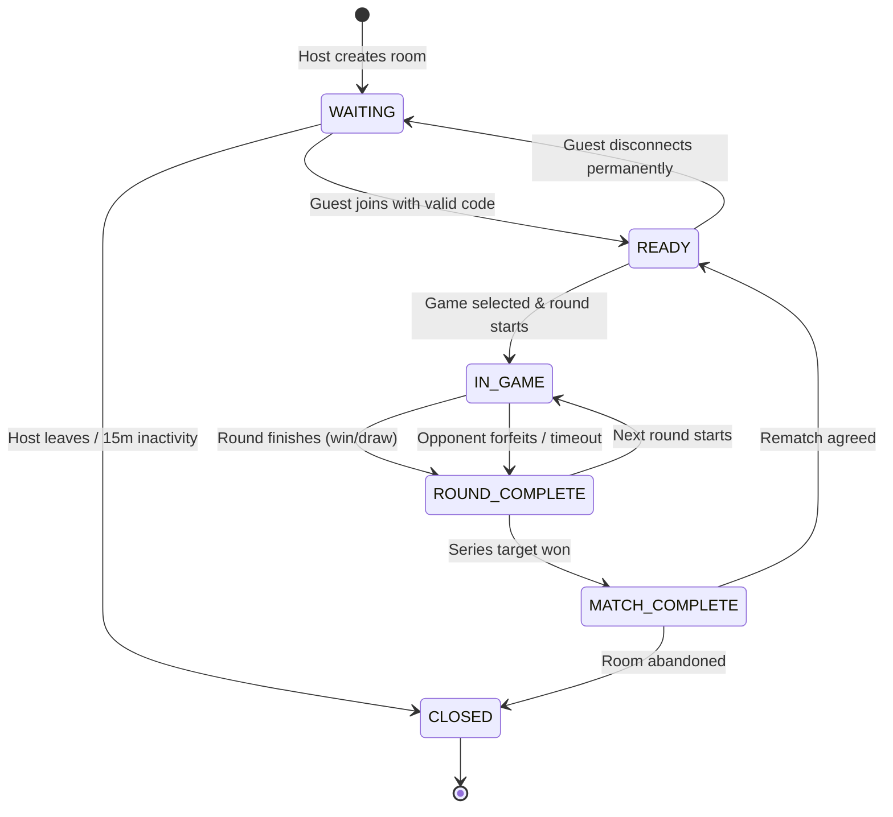

# Room System — Bro v Bro

## 1. Overview

A **Room** is an ephemeral, isolated container designed to connect exactly **two players** for a Bro v Bro session.

The room system coordinates:
- Connection and pairing
- Player slot assignment (Host vs Guest)
- Presence tracking and heartbeat
- Lifecycle states before, between, and after matches

---

## 2. Room Data Model

```typescript
export type RoomStatus =
  | 'WAITING'         // Host created room, waiting for Guest
  | 'READY'           // Both players present and ready
  | 'IN_GAME'         // A round is actively being played
  | 'ROUND_COMPLETE'  // Round finished, displaying round results / picking next
  | 'MATCH_COMPLETE'  // Series target reached, displaying final champion
  | 'CLOSED';         // Room terminated / expired

export interface PlayerSlot {
  id: string;              // Ephemeral player UUID
  sessionToken: string;    // Secret client token stored in sessionStorage for reconnection
  name: string;            // Display name (e.g., "Abhay")
  isHost: boolean;         // True for slot A, false for slot B
  isConnected: boolean;    // Current realtime connection flag
  lastSeenAt: number;      // Epoch timestamp for heartbeat/cleanup
}

export interface Room {
  id: string;              // Internal unique room ID
  code: string;            // Human-readable join code (e.g., "BRO42")
  status: RoomStatus;
  players: {
    playerA: PlayerSlot | null; // Host slot
    playerB: PlayerSlot | null; // Guest slot
  };
  currentMatchId: string | null;
  createdAt: number;
  updatedAt: number;
}
```

---

## 3. Room Codes

- **Format:** 4 to 5 uppercase alphanumeric characters (e.g., `BRO99`, `V7KZ`).
- **Unambiguous Alphabet:** Omit visually confusing characters: `0`, `O`, `1`, `I`, `L`.
- **Generation:** Random generation with collision checks against active in-memory rooms.
- **URL Sharing:** Supported via `/join/:code` deep links.

---

## 4. Lifecycle & State Machine



---

## 5. Player Roles & Privileges

| Action | Host (Player A) | Guest (Player B) |
|---|---|---|
| Set Series Rule (e.g., Best of 5) | Yes | View only |
| Kick inactive guest | Yes | No |
| Close room | Yes | Can only leave |
| Game selection | Round 1 | Round N (if lost previous round) |
| Rematch request | Yes | Yes (requires both to accept) |

---

## 6. Disconnect & Cleanup Rules

1. **Heartbeat:** Clients ping the server every 5 seconds. If no ping is received for 15 seconds, `isConnected` becomes `false`.
2. **Mid-Game Reconnect Grace Period:**
   - When a player drops during `IN_GAME`, the game clock pauses for **30 seconds**.
   - If the player reconnects with their `sessionToken`, the server restores their state and resumes the game.
   - If the 30-second timer expires, the disconnected player forfeits the round.
3. **Room Expiration (Garbage Collection):**
   - Inactive empty rooms: deleted after **5 minutes**.
   - Active rooms with no interaction: purged from memory after **2 hours**.
