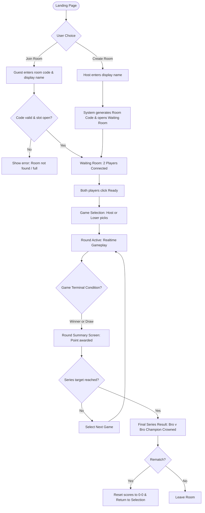

# User Flows & Edge Cases — Bro v Bro

## 1. Primary User Journey

---

## 2. Screen-by-Screen Breakdown

### 2.1 Landing Page
- Minimal, punchy hero screen.
- Main CTA: **"CREATE ROOM"** (primary button) and **"JOIN ROOM"** (secondary button / input field).
- Direct room URL support (e.g. `brovbro.app/join/BRO99` skips manual code entry).

### 2.2 Waiting Room / Lobby
- Displays large, copyable **Room Code** and direct share link.
- Shows two player slots:
  - **Player 1 (Host):** Crown icon, ready status indicator.
  - **Player 2 (Guest):** "Waiting for bro to join..." pulse animation until joined.
- Action: Once both players are present, Host can select the series condition (e.g., Best of 3, Best of 5, First to 3) and launch.

### 2.3 Game Selection Screen
- Visual grid or picker card showing available mini-games with estimated duration (e.g. "Tic Tac Toe ~1 min", "Reaction ~30s", "Wordle ~2 min").
- Selection turn logic:
  - Round 1: Host picks.
  - Subsequent rounds: Loser of the previous round picks (classic arcade rubberbanding).

### 2.4 Active Game Screen
- Persistent, compact top bar showing:
  - Player names and series score (`Abhay 2 - 1 Rahul`)
  - Current Game Title
  - Active turn / timer indicators
- Dedicated game viewport rendering the current mini-game's UI.

### 2.5 Round Result Screen
- Bold, instant feedback: **"Abhay takes Round 2!"** (or "Round Drawn!").
- Animated score update (e.g. `2` turns to `3`).
- Countdown or CTA: **"Next Game: Rahul is choosing..."**.

### 2.6 Final Match Result
- Confetti / visual fanfare for the match champion.
- Complete series recap table:
  - Round 1: Wordle (Winner: Abhay)
  - Round 2: Chess (Winner: Rahul)
  - Round 3: Minesweeper (Winner: Abhay)
- Options: **"Rematch"** (keeps players in room, resets score) or **"Leave"**.

---

## 3. Edge Cases & Handling Matrix

| Edge Case | Expected System Behavior | Implementation Status |
|---|---|---|
| **Invalid room code** | Client shows inline error: *"Room code not found or expired."* Prompt re-entry. | Planned (V1 Skeleton) |
| **Room is full (>2 players)** | If a 3rd user tries to join code, reject join request with *"Room is full (2/2 players)."* | Planned (V1 Skeleton) |
| **Guest leaves waiting room** | Slot 2 returns to *"Waiting for bro..."*. Host notified via toast/banner. | Planned (V1 Skeleton) |
| **Host leaves waiting room** | Room closes, guest is notified with *"Host closed the room"* and redirected to landing. | Planned (V1 Skeleton) |
| **Player disconnects mid-game** | Game pauses; 30-second reconnect grace period begins. Opponent sees countdown timer. | Planned (V1 Skeleton) |
| **Player reconnects within grace period** | Re-authenticates via ephemeral session token; receives authoritative state snapshot; game resumes. | Planned (V1 Skeleton) |
| **Player abandons / timeout expires** | Opponent is awarded win by forfeit (`reason: FORFEIT`). Score updates accordingly. | Planned (V1 Skeleton) |
| **Simultaneous game selection** | Selection is strictly turn-based (Round 1: Host; Round N: Loser). Only the authorized picker can send `game:select`. | Planned (V1 Match) |
| **Duplicate moves / Double-click** | Server move validation rejects moves if it is not the player's turn or cell is already filled. Drops duplicates idempotently. | Planned (V1 Game Engine) |
| **Stale socket events** | State packets include sequential `stateVersion` integer. Clients reject incoming packets older than current version. | Planned (V1 Realtime) |
